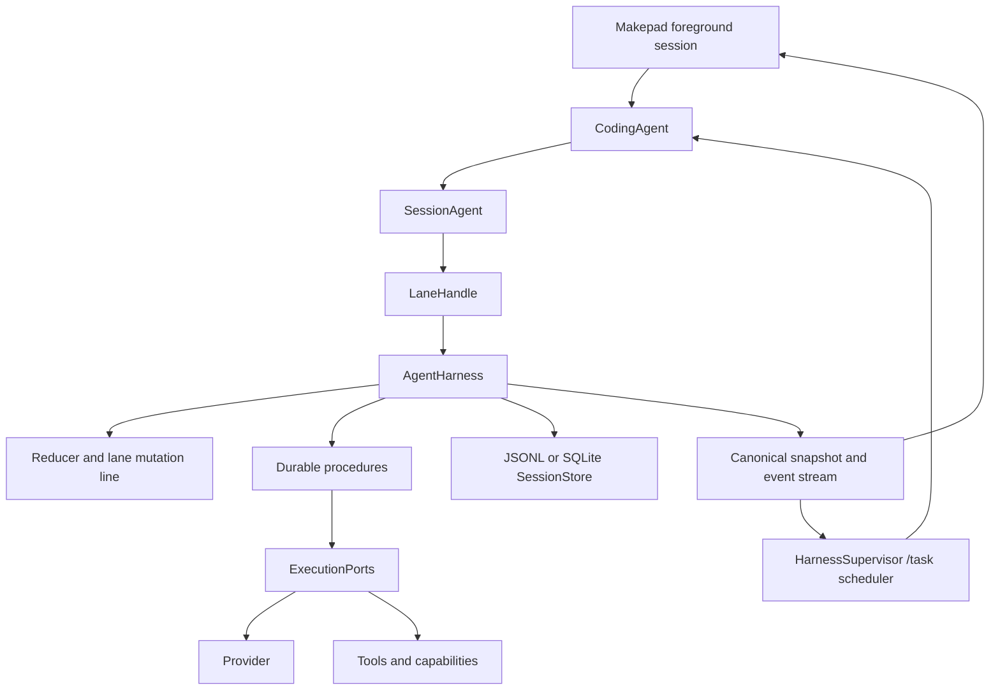

# Canonical Threadlane Agent Architecture

## Status

Approved design for the first Threadlane agent/coding-agent restructuring slice.

## Goal

Make `threadlane-agent::harness` the only durable execution authority for foreground chat, explicit `/task` work, and model-managed subagents. Remove the split-brain persistence and lifecycle orchestration currently divided between `UnifiedAgent`, `CodingAgent`, `HarnessJournal`, and `HarnessSupervisor`.

The design takes the useful Oh My Pi lesson—separate execution state, durable lifecycle, tool/provider ports, and presentation—without copying its TypeScript layout or APIs.

## Current problem

The repository already contains a durable Harness V2 core: typed entries and records, reducer-based recovery, memory/JSONL/SQLite stores, gated effects, procedures, snapshots, events, usage records, and child-lane concepts. Recent consolidation commits extracted provider and tool primitives and introduced `TurnDriver`.

The integration is still structurally duplicated:

- `UnifiedAgent` owns working turn state, provider/tool execution, queues, events, and a harness reference.
- `CodingAgent` owns project resources, a second journal adapter, subagent orchestration, cancellation, and session wiring in a very large module.
- `HarnessSupervisor` owns a second lane model, operation log, queue state, sequence calculations, lifecycle writes, recovery, and task projection.
- `SessionTree` remains a compatibility transcript model while V2 entries and records are written through another path.
- `AgentEvent`, `HarnessEvent`, and supervisor task events form overlapping lifecycle streams.

This creates duplicate sequence allocation, possible double persistence, divergent cancellation/recovery paths, and a large public surface that does not make ownership clear.

## Architecture

### Ownership

| Layer | Owns | Must not own |
|---|---|---|
| `threadlane-agent::harness` | Session store, lane state, operation records, queues, recovery, effect gating, snapshots, durable events, usage ledger | Project skills, WASI/MCP resources, UI state |
| `threadlane-agent` runtime | Provider/tool execution ports, turn-driving primitives, compatibility `AgentLoop` facade | Session-specific persistence decisions outside the harness |
| `threadlane-coding-agent` | Project context, system prompts, capabilities, MCP/WASI/skills, permission policy, subagent configuration | Lane records, sequence allocation, duplicate journals |
| `HarnessSupervisor` | Explicit `/task` registry, scheduling, cancellation intent, task summaries | Durable lane state, operation logs, provider/tool execution |
| Makepad app | UI projections and user interaction | Agent persistence or recovery decisions |
| ACP | External subprocess transport and event mapping | Harness V2 durability until subprocess effects are explicitly modeled |

Ordinary foreground sessions remain distinct from supervisor tasks at the application layer. They share the same durable harness implementation but are not mirrored into the supervisor registry.

### Canonical session contract

Add a session-level composition boundary in `threadlane-agent`:

- `SessionAgent` owns one `AgentHarness` and the execution ports for one saved session.
- `LaneHandle` identifies a durable lane and exposes accepted operations: prompt, steer, follow-up, next-run, abort, resume, snapshot, and watch.
- `ExecutionPorts` supplies provider, tool, hook, timer, and deferred-work adapters to durable procedures.
- `HarnessEvent` is the canonical lifecycle stream. Existing `AgentEvent` remains a compatibility projection for current consumers.

The exact type names may be refined during implementation, but the invariant is fixed: every accepted operation enters the harness, receives durable intent before external effects, and resolves from the same reduced state used during recovery.

`UnifiedAgent` remains temporarily as a compatibility/composition facade. Production callers must stop using it to mutate queues, journals, or session files directly. `TurnDriver` becomes an execution adapter invoked by the canonical lane procedure rather than a second owner of run state.

### Coding-agent structure

Restructure the current monolith around ownership seams:

- `coding_agent/runtime.rs` — `CodingAgent` composition root and public session operations.
- `coding_agent/capabilities.rs` — skill, plan, subagent, MCP, and WASI capability registration.
- `coding_agent/harness.rs` — one canonical session harness adapter and event/watch projection.
- `coding_agent/subagents.rs` — child-lane configuration, deterministic identity, result projection, and recovery integration.
- `coding_agent/broker.rs` — host capability and managed-process dispatch.
- `coding_agent/mod.rs` — module declarations and intentionally small compatibility exports.

`coding_agent/harness_journal.rs` remains only as a transitional adapter for unavoidable legacy callbacks. It is deleted after all callers migrate. There is one `AgentJournal` implementation for the canonical session path and one child-lane configuration path, not parallel persistence implementations.

### Supervisor structure

`HarnessSupervisor` retains its task registry and scheduling API. Each task references a canonical lane handle/session runtime. Remove or stop using supervisor-owned:

- lane operation logs;
- sequence recomputation;
- direct `JsonlStore` reopening for lifecycle writes;
- duplicate V2 and legacy record append helpers;
- tool intent/completion persistence;
- recovery reducers.

Supervisor task status is derived from harness snapshots and events. Cancellation first submits durable abort intent through the lane, then interrupts the local Tokio task as an execution mechanism.

### Events and snapshots

The harness provides one snapshot-plus-buffered-event subscription contract. A completion or lifecycle event is emitted only after its durable entry/record commits. The coding agent and supervisor translate this canonical stream into their compatibility projections; the UI remains a consumer, not an authority.

### Data flow



## Failure and compatibility policy

- Storage failure faults the harness and rejects subsequent operations with the same typed fault.
- Malformed complete records remain corruption errors; only a provably torn final JSONL line is tolerated.
- Unsafe unfinished tools become interrupted results. Safe replay requires both persisted and current declarations to agree.
- Abort intent is durable before task cancellation; reconciliation is idempotent.
- Legacy sessions continue to load through the compatibility path and become idle `main` lanes until their first V2 write.
- ACP behavior remains unchanged and outside this migration.
- `AgentLoop` remains only for genuine compatibility consumers. New production code cannot create a parallel persistence path through it.

## Delivery slices

1. **Canonical session/lane API and event bridge** in `threadlane-agent`; prove it with memory and JSONL tests.
2. **Foreground coding-agent cutover**; eliminate duplicate main-session journal and queue writes.
3. **Supervisor cutover**; retain task scheduling while consuming canonical lane state.
4. **Subagent convergence**; remove specialized child journal/recovery and use deterministic child lanes.
5. **Structural cleanup**; split `coding_agent/mod.rs`, delete superseded helpers, narrow public exports, and update durable architecture docs.

Each slice must leave focused tests and the workspace green before the next slice begins. Subagents edit only their assigned files and do not run project-wide validation; orchestration performs validation at phase boundaries.

## Acceptance criteria

- Foreground, `/task`, and model subagent runs use one durable implementation.
- One session writer and sequence allocator serve all lane entries and records.
- No production caller directly appends session or operation-log records outside the harness.
- Recovery, cancellation, tool replay, queue behavior, and usage accounting remain covered.
- Existing JSONL sessions retain transcript and configuration compatibility.
- `HarnessSupervisor` has no second operation-log or lane-recovery authority.
- ACP behavior is unchanged and explicitly outside the durable contract.
- `threadlane-agent` and `threadlane-coding-agent` public surfaces are smaller and ownership-oriented.

## Verification

Focused tests must cover the canonical lane API, event commit ordering, writer/sequence uniqueness, foreground restart, supervisor restart, child-lane replay, cancellation hierarchy, and compatibility loading. Required repository gates are:

```bash
cargo test -p threadlane-agent
cargo test -p threadlane-coding-agent
cargo check -p threadlane
cargo test --workspace
git diff --check
```

Makepad Studio runtime verification remains required for UI behavior changes but is not part of this core architecture slice.
