# Threadlane Durable Agent Harness V2 Roadmap

> **For implementation:** execute this roadmap milestone by milestone. Each milestone must leave the workspace passing and must satisfy its exit gate before the next begins.

**Goal:** Make every accepted foreground or background agent operation crash-recoverable from its last safe effect boundary, while preserving existing Threadlane sessions and UI behavior.

**Chosen approach:** Keep straight-line async Rust procedures and route every effect through one injected boundary. Reuse the current `AgentLoop`, provider router, tool executors, `SessionTree`, operation records, and `CodingAgent`; do not build a generator/state-machine executor or a second GUI runtime.

**Compatibility:** Existing Threadlane JSONL sessions must open as an idle `main` lane with the same active branch, model, plan, facts, and transcript. Existing ACP sessions remain on their ACP runtime until ACP durability is designed separately.

**Primary crates:** `threadlane-agent` owns the durable core; `threadlane-coding-agent` adapts skills, extensions, MCP, WASI, and subagents; `threadlane-provider` exposes provider requests and deferred redemption; `threadlane` renders snapshots and events.

---

## 1. What the reference design teaches us

The reference is not mainly an API proposal. Its important contribution is a small set of invariants that make crash recovery tractable:

1. **Intent before effect.** Persist the operation, attempt, or tool invocation—including provisioned result IDs—before starting provider, tool, hook, or structural work.
2. **Append-only results.** Complete an intent by appending its provisioned entry. Recovery asks whether that exact entry exists; it never guesses from UI events.
3. **One reducer.** Live lane state and restored lane state are the same reduction of durable entries and records. Recovery is normal execution resumed from reduced state.
4. **One operation per lane.** Lanes may run concurrently, but work within a lane is serialized by a short mutation line.
5. **One effect boundary.** Storage writes, provider requests, tools, hooks, backoff, deferred fetches, and cancellation cross one `Effects` surface. Manual driving wraps production effects rather than introducing a test-only executor.
6. **Conversation and orchestration stay separate.** Tree entries are model-visible history; operation records are recovery metadata and never enter context.
7. **Durable acceptance.** Prompts, steering, follow-ups, next-run input, deferred writes, and aborts resolve only after their record commits.
8. **No partial UI contract.** A client receives an atomic snapshot and then ordered live events. Durable facts are emitted only after commit.
9. **Recovery is bounded and explicit.** Attempt counts survive restarts; unsafe tool effects become synthetic interrupted results; safe effects replay only if both the recorded and current declarations permit it.
10. **Cost is a ledger.** Usage is persisted per physical request or tool execution, including failed, discarded, and replayed work.

Threadlane should adopt these invariants, not copy the reference TypeScript layout or APIs literally.

---

## 2. Current Threadlane baseline

### 2.1 What already exists and should be reused

| Capability | Current implementation | Assessment |
|---|---|---|
| Passive conversation DAG | `crates/threadlane-agent/src/session_tree.rs` stores parent-linked `SessionNode`s and supports passive sibling branches | Strong foundation; keep the DAG and legacy loader |
| JSONL session persistence | `SessionTree` appends messages, metadata, plans, and global facts; transactional rewrites protect metadata updates | Useful but not yet one backend-neutral session contract |
| Durable operation vocabulary | `crates/threadlane-agent/src/op_log.rs` has operation start/finish, attempts, tool starts, queues, deferred writes, navigation, outcomes, and replay safety | Good seed; record payloads and validation are incomplete |
| Intent before tool effect | `AgentLoop` calls `ToolIntentRecorder` after clearance and before execution | Correct boundary already exists |
| Tool hooks and execution | `BeforeToolCallHook`, `AfterToolCallHook`, extension executors, core tools, sequential/parallel modes | Reuse by splitting preparation, execution, and finalization |
| Provider-neutral routing | `threadlane-provider::router::ProviderClient` maps OpenAI and other providers to shared stream events | Reuse; expose one-response primitive beneath the loop |
| Steering/follow-up queues | `AgentLoop` has process-local queues; `HarnessSupervisor` has per-lane steer/follow-up/next-run queues with durable enqueue-before-mutate behavior | Merge into the durable lane core |
| Lane inventory | `HarnessSupervisor::Lane` tracks leaf, status, parent, queue, operation log, usage, and active run | Useful model, but currently scheduler-local and incomplete |
| Recovery helpers | `reconcile_op_log_recovery`, `interrupted_subagent_lanes`, safe replay, unsafe synthesis, and subagent checkpoints | Preserve tests and fold behavior into the general reducer |
| Subagent durability | `SubagentLaneJournal` records child intent, checkpoints turns, replays safe tools, aborts unsafe work, and commits passive sibling branches | Most mature durable path; use it as migration evidence |
| Cancellation | Background tasks and foreground generations can be aborted; subagent cancellation is persisted | External cancellation exists, but general run abort is not durable/reconciled |
| Event stream | `AgentEvent` plus Tokio broadcast; UI forwards events onto the Makepad thread | Reuse transport; enrich event identity and commit ordering |
| UI recovery signal | Session activities and health derive from persisted harness/subagent records | Keep as a compatibility view until snapshots replace it |
| Metrics | `HarnessMetrics`, per-lane accumulated usage, provider usage, and persisted context-usage fact | Useful UI data; not a durable cost ledger |
| Tests | Unit and integration coverage for tool intent ordering, supervisor queues, cancellation, recovery, subagent checkpoints, session persistence, and provider behavior | Strong regression base; add systematic crash-prefix suites |

### 2.2 The important architectural split

Foreground chat currently runs through `App::SessionRuntime -> CodingAgent::handle_input_with_images -> AgentLoop`. Explicit `/task` background work runs through `HarnessSupervisor -> CodingAgent`. The supervisor is therefore a task scheduler and registry, not the universal execution harness.

This split should remain at the application layer. The durable core belongs **under** `CodingAgent`, in `threadlane-agent`, so both foreground sessions and supervisor-owned background tasks use it without mirroring ordinary chat sessions into `HarnessSupervisor`. This preserves the repository rule that the supervisor owns only explicit background tasks.

### 2.3 Gaps against the target

| Area | Gap | Consequence today |
|---|---|---|
| Accepted prompts | `OperationStarted` does not persist normalized prompt entries or provisioned IDs | A crash after acceptance cannot reconstruct the exact run |
| Attempts | `TaskAttempt` records a task string, not typed assistant/compaction/summary attempts with durable result IDs and counts | Provider retries and crash loops are not bounded durably |
| Tool completion | `ToolStarted.result_entry_id` is not the sole completion identity; `terminate` is not persisted on the result entry | Recovery cannot prove exact tool-batch state |
| Parallel tools | Each parallel task performs clearance, intent, and execution together | Intent order is scheduler-dependent and a mid-batch crash is hard to reduce |
| Queues | Queue records lack provisioned entry identity and cancellation; live queue storage is split across `AgentLoop` and supervisor | Accepted input can be lost, resurrected, or consumed at a different boundary |
| Abort | No general `AbortRequested` record and no transcript reconciliation | Foreground stop can leave an incomplete assistant/tool turn |
| Recovery | Current recovery finds open IDs, synthesizes some results, and then commonly closes old runs | It does not resume the precise assistant, compaction, deferred, or batch step |
| Validation | Loaders skip malformed lines and do not validate record relationships | Corruption can become silent data loss or inconsistent live state |
| Sequencing | Session entries and lane sidecars do not share one session sequence allocator; lane code derives sequence from local vectors | Cross-lane order can collide or drift after restart |
| Storage errors | Empty IDs or ignored parse/write errors can stand in for failed persistence | A run may continue after its durable prefix failed |
| Single writer | The process-wide mutex coordinates only this process; no session writer claim exists | Two processes can mutate one session |
| Compaction | The live loop can replace message state and `SessionTree::replace_active_branch` rewrites active history | Compaction is not an append-only durable operation |
| Navigation | Supervisor navigation is separate from normal session switching and lacks full move-first recovery | A crash can separate the leaf move, summary, and finish |
| Deferred providers | Message types contain a deferred handle, but provider fetch/cancel and durable redemption are not implemented | Deferred work cannot suspend and resume safely |
| Hooks | Only context transform, tool hooks, and stop-after-turn exist | No durable run/resume, request, response, compaction, or navigation interception contract |
| Events | Events omit lane/run/turn identity and `MessageEnd` can precede `CodingAgent` persistence | Observers can see facts that are not yet durable |
| Snapshots | UI reconstructs transcript and activity through separate paths | Attach/reconnect can miss the boundary between current state and live events |
| Usage | Totals are volatile or stored as a latest-value fact | Failed attempts, discarded overflow responses, and replays are not auditable |
| Effects | Procedures call storage, provider, hooks, and tools directly | No deterministic manual stepping or exhaustive crash-prefix testing |
| Subagents | Durable behavior is specialized in `CodingAgent` instead of using the same lane/run machinery | Two recovery models must stay correct |
| Forks | `SessionTree::fork_branch` is not a repository-level idle copy with deterministic parent linkage | Safe replay can create duplicate child sessions |
| Telemetry | No explicit, passive execution context spans the harness | Cross-run diagnosis relies on logs and UI events |
| Storage parity | Only the current JSONL representation is production-ready; no memory conformance backend or SQLite repository exists | Reducer and writer behavior cannot be proven backend-neutral |

---

## 3. Recommended V2 architecture

```mermaid
flowchart TD
    UI[Makepad App / CLI] --> CA[CodingAgent adapter]
    BG[HarnessSupervisor / explicit tasks] --> CA
    CA --> H[AgentHarness]
    H --> L[LaneRuntime: main + child lanes]
    L --> P[Run / compaction / navigation procedures]
    P --> FX[Effects boundary]
    FX --> S[SessionStore]
    FX --> PR[Provider request primitive]
    FX --> T[Tool phases]
    FX --> HK[Hooks]
    H --> W[Atomic snapshots + live events]
    S --> J[JSONL]
    S --> M[Memory tests]
    S --> Q[SQLite after parity]
```



### 3.1 Ownership

- `threadlane-agent::harness` owns session entries, lane records, reduction, mutation lines, effect gating, procedures, public results, snapshots, hooks, events, and usage records.
- Existing `AgentLoop` remains a compatibility facade. Its provider and tool internals are extracted into stateless primitives used by both the old facade and V2.
- `CodingAgent` owns project-specific resources: skills, prompt templates, extensions, MCP/WASI executors, permission hooks, system prompt construction, and subagent tool registration.
- `HarnessSupervisor` continues to own only explicit `/task` scheduling, task registry, task cancellation, and sidebar summaries. It calls the same `CodingAgent`/`AgentHarness` path as foreground chat.
- The Makepad app keeps `SessionRuntime`, but the runtime holds a harness-backed `CodingAgent` and consumes lane snapshots/events instead of manually persisting after streamed events.
- ACP remains a separate transport-backed session runtime in V2. It may later implement the same lane facade, but this roadmap does not pretend ACP subprocess effects are already durable.

### 3.2 New module map

Create focused modules under `crates/threadlane-agent/src/harness/` only as each milestone needs them:

| Module | Responsibility |
|---|---|
| `mod.rs` | Public exports and `AgentHarness` construction |
| `types.rs` | Entries, records, outcomes, errors, snapshots, action descriptions |
| `store.rs` | Minimal `SessionStore` contract and session-scoped writer claim |
| `memory.rs` | Reference backend used by reducer and interleaving tests |
| `jsonl.rs` | Current-session compatibility loader and V2 append/read implementation |
| `reducer.rs` | Pure validation and durable-prefix-to-`LaneState` reduction |
| `effects.rs` | Production effects, gated effects, and fault propagation |
| `lane.rs` | Per-lane mutation line, runtime state, queues, watch surface |
| `procedure.rs` | Straight-line run, abort, compaction, navigation, and resume procedures |
| `hooks.rs` | Harness-level hook registry and replay semantics |
| `events.rs` | Lane/session event bus and atomic watch buffering |
| `telemetry.rs` | No-op-first explicit execution context |

Do not create all files as scaffolding. Add a module only in the milestone that supplies working behavior and tests.

### 3.3 Durable model

The V2 session has four logical parts sharing one monotonic session sequence:

1. Append-only conversation/configuration entries.
2. Permanent lane names with leaf pointers; every session has `main`.
3. One chronological operation log per lane.
4. Append-only global facts with latest-write-wins reads.

The first implementation may continue using a session JSONL file plus an operation sidecar, provided `JsonlStore` owns both under one writer claim and one sequence allocator. Callers must never append either file directly.

### 3.4 Minimum record catalog

Replace the stringly or incomplete record shapes with typed variants:

- `OperationStarted { source_leaf_id, intent: Run | Compaction | Navigation }`
- `AbortRequested { run_id }`
- `OperationFinished { run_id, outcome, error }`
- `StepAttempt { run_id, step, attempt, result_entry_id, compaction_reason }`
- `ToolStarted { run_id, assistant_entry_id, tool_index, tool_call_id, tool_name, effective_args, result_entry_id, replay }`
- `QueueEnqueued { queue, run_id, target: ProvisionedEntry }`
- `QueueCancelled { run_id, entry_id }`
- `WriteDeferred { run_id, target: ProvisionedEntry }`
- `Usage { cause, run_id, entry_id, usage, attempt/tool identity }`

`Navigation` becomes an operation intent, not a second competing operation record. Keep a compatibility decoder for current sidecars and reduce them conservatively to idle or safely interrupted state.

### 3.5 Effect and mutation boundaries

Every procedure receives only an `Effects` handle. It cannot access stores, providers, tool executors, hooks, or timers directly. Each lane owns a FIFO mutation line. A mutation job performs exactly:

1. Validate current `LaneState`.
2. Commit at most one durable mutation.
3. Update the same in-memory state.

Provider requests, tool execution, hook bodies, telemetry export, and retry sleeps never hold the mutation line. Conditional finishes revalidate after those effects.

### 3.6 Failure policy

- Expected rejections—busy lane, no active run, invalid message, unknown target—return typed results and write nothing.
- Accepted operations resolve with completed, failed, aborted, declined, or suspended outcomes.
- A storage failure faults the entire harness, signals active effects, rejects further calls with the same fault, and leaves a valid durable prefix.
- Corrupt records fail open with a specific corruption report; they are never silently skipped.
- A final torn JSONL tail may be ignored only when it is provably the incomplete final line. Malformed complete lines are corruption.

---

## 4. Implementation roadmap

### Milestone 0 — Freeze compatibility and invariants

**Purpose:** Prevent the migration from silently changing current sessions, providers, tools, or UI behavior.

**Files:**

- Add fixtures under `crates/threadlane-agent/tests/fixtures/sessions/`.
- Add integration coverage in `crates/threadlane-agent/tests/harness_compat.rs`.
- Reuse existing tests in `crates/threadlane-agent/tests/agent_tests.rs`, `crates/threadlane-coding-agent/tests/`, and supervisor unit tests.

**Work:**

- [ ] Capture legacy JSONL fixtures for: message-only sessions, metadata and active leaf, images, model, plan, global facts, compaction/custom entries, passive subagent branches, and a final torn line.
- [ ] Assert every valid fixture opens with one idle `main` lane and an identical visible transcript/configuration.
- [ ] Assert malformed complete records fail rather than disappear.
- [ ] Record current `AgentLoop` event order for no-tool, one-tool, parallel-tool, overflow, hook-blocked, and aborted runs.
- [ ] Document the V2 invariants as assertions in the test helpers: one open operation per lane, unique provisioned IDs, and intent-before-effect.

**Verification:**

```bash
cargo test -p threadlane-agent
cargo test -p threadlane-coding-agent
```

**Exit gate:** Compatibility fixtures and existing tests pass before V2 production code is introduced.

### Milestone 1 — Session store, IDs, sequencing, and writer claim

**Purpose:** Create one trustworthy persistence boundary before adding execution.

**Files:**

- Create `crates/threadlane-agent/src/harness/{mod.rs,types.rs,store.rs,memory.rs,jsonl.rs}`.
- Modify `crates/threadlane-agent/src/lib.rs` to export only the landed surface.
- Adapt `crates/threadlane-agent/src/session_tree.rs` behind `JsonlStore`; retain its compatibility API during migration.
- Adapt `crates/threadlane-agent/src/op_log.rs` decoding behind `JsonlStore`; remove direct appends only after all callers move.

**Work:**

- [ ] Define entries, provisioned entries, lane facts, typed records, `NewRecord`, and a session-scoped ID generator.
- [ ] Define the smallest store contract needed by the reducer: append entry/record/fact, move/create lane, get entry, list lanes, bounded branch query, bounded lane-log query, and usage sum.
- [ ] Implement `MemoryStore` as the reference semantics.
- [ ] Implement `JsonlStore` over the current files with one shared sequence allocator and synchronized append path.
- [ ] Acquire a non-blocking OS writer lock when opening a writable session and release it on close. Prefer the Rust standard library when the workspace toolchain supports file locking; add a focused locking dependency only if it does not.
- [ ] Make entry append atomically read the lane leaf, assign parent/sequence/time, append, and move the leaf.
- [ ] Treat write/fsync failure as an error; never return an empty node ID.
- [ ] Support a torn final line, reject malformed complete lines, duplicate IDs, missing parents, decreasing/duplicate sequences, and invalid lane names.
- [ ] Decode current session JSONL into the V2 logical model as idle `main`; no eager file rewrite.
- [ ] Start V2 serialization on the first V2 write while preserving the original logical tree.

**Tests:** Run one conformance suite against memory and JSONL, including two lanes appending concurrently and receiving unique increasing sequence numbers.

**Exit gate:** The store can round-trip all legacy fixtures and both backends return identical entries, lanes, facts, records, and errors.

### Milestone 2 — Pure reducer and corruption checks

**Purpose:** Prove recovery before live execution writes new states.

**Files:**

- Create `crates/threadlane-agent/src/harness/reducer.rs`.
- Extend `crates/threadlane-agent/src/harness/types.rs` with `LaneState`, `ToolBatchState`, and `SuspendedOperation`.
- Add `crates/threadlane-agent/tests/harness_recovery.rs`.

**Work:**

- [ ] Reduce one lane from its leaf, latest open operation, operation records, and referenced entries.
- [ ] Reconstruct missing initial messages, current step/attempt count, unresolved tool batch, pending queues, pending writes, deferred handle, aborting state, overflow guard, and structural targets.
- [ ] Validate references to operations, record ordering after finish, consecutive attempts, compaction reasons, queue cancellation, tool ordinals/names, and provisioned entry content.
- [ ] Return idle, suspended-crash, or suspended-deferred without starting effects.
- [ ] Keep reduction pure: no synthetic entry, replay, finish record, hook, provider, or tool call occurs while opening a session.
- [ ] Add the fixed-point comparator used later to verify live state equals reduced state after settle, suspend, abort, and resume.

**Tests:** Prefill durable prefixes for operation acceptance, unfinished attempts, every tool X1–X5 state, partial queue consumption, deferred writes, abort markers, terminal failure, compaction, navigation, and deferred handles; reduce each twice and assert identical state.

**Exit gate:** Every state live execution intends to write already has a tested deterministic reduction and invalid histories fail with specific corruption errors.

### Milestone 3 — Split reusable provider and tool primitives

**Purpose:** Insert durability between existing phases without rewriting provider/tool behavior.

**Files:**

- Modify `crates/threadlane-agent/src/loop_engine.rs`.
- Add focused modules only if the extracted code no longer fits clearly: `provider_step.rs` and `tool_batch.rs` under `crates/threadlane-agent/src/`.
- Preserve public `Agent`/`AgentLoop` behavior and exports.

**Work:**

- [ ] Extract one assistant response into a stateless function that emits current stream events, returns one final assistant message plus usage, and mutates no session state.
- [ ] Split a tool call into `prepare_tool_call`, `execute_tool_call`, and `finalize_tool_call`.
- [ ] Make batch preparation and intent callbacks sequential in source order.
- [ ] Keep only phase-two effects parallel; finalize and emit results in source order.
- [ ] Persist/return the aggregate rule that automatic continuation stops only when every finalized result terminates.
- [ ] Keep truncated tool-call batches non-executing.
- [ ] Reimplement current `AgentLoop` as a thin composition of these primitives so existing callers remain unchanged.

**Verification:** Existing `agent_tests`, provider routing tests, hook tests, tool intent tests, and parallel ordering tests pass without fixture changes.

**Exit gate:** V2 can call the same primitives as V1, and the old loop remains behaviorally compatible.

### Milestone 4 — Effects boundary, lane mutation line, and manual drive

**Purpose:** Establish deterministic execution and eliminate lane check-then-write races.

**Files:**

- Create `crates/threadlane-agent/src/harness/{effects.rs,lane.rs}`.
- Extend `crates/threadlane-agent/src/harness/mod.rs` with construction, lookup, close, and manual-drive APIs.
- Add `crates/threadlane-agent/tests/harness_drive.rs`.

**Work:**

- [ ] Implement production effects for every durable write, conditional commit, provider step, tool effect, hook call, deferred fetch/cancel, and retry timer.
- [ ] Implement one FIFO mutation line per lane; never hold it across external effects.
- [ ] Implement `GatedEffects`, stable `peek_action`, single-action `execute_action`, and `run_to_completion`.
- [ ] Keep public lane input calls ungated so tests can inject prompt, queue, write, and abort races while a procedure is parked.
- [ ] Fault the harness on write or invariant failure and reject all parked effects on close without adding records.
- [ ] Implement an accepted no-tool run skeleton: operation intent, initial message append, one assistant attempt, assistant append, finish.

**Tests:** Prove zero writes/provider/tool calls while parked, stable peeks, one release per action, close/reopen at each boundary, and automatic/manual durable-log equivalence for no-tool runs.

**Exit gate:** The real production procedure is deterministically steppable without a second state machine.

### Milestone 5 — Durable run procedure and queues

**Purpose:** Replace the foreground loop's orchestration with resumable straight-line procedures.

**Files:**

- Create `crates/threadlane-agent/src/harness/procedure.rs`.
- Extend `lane.rs`, `effects.rs`, `types.rs`, and reducer tests.
- Keep `loop_engine.rs` primitives stateless.

**Work:**

- [ ] Accept normalized prompts with captured `nextRun` messages and provisioned entry IDs in one mutation job.
- [ ] Add durable `steer`, `follow_up`, `next_run`, and `cancel_queued` APIs.
- [ ] Apply deferred writes, consume steering, check compaction pressure, execute a turn, then consume follow-ups at checkpoints.
- [ ] Implement durable assistant attempt counts, retry classification, capped backoff, and terminal error entries.
- [ ] Persist usage immediately after each physical provider request and before classifying, retrying, or discarding its response.
- [ ] Implement once-per-conversational-input overflow compaction and distinguish genuine output-limit stops from recoverable context pressure.
- [ ] Make finish conditional so accepted input or abort wins cleanly at the boundary.
- [ ] Resume an unfinished step before consuming newly accepted checkpoint input.
- [ ] Preserve the append-only provider-context invariant, with compaction as the only deliberate invalidation.

**Tests:** Exact writer traces for no-tool, retry, exhausted retry, steering during request, follow-up at finish, queue cancellation, deferred write, next-run race, overflow success, overflow give-up, and failed-run drain.

**Exit gate:** A prompt accepted at any boundary either resumes to a defined outcome or remains explicitly suspended; accepted queue/write input is never lost.

### Milestone 6 — Durable tool batches and abort reconciliation

**Purpose:** Cover the largest external-effect uncertainty window.

**Files:**

- Extend `procedure.rs`, `reducer.rs`, and `tool_batch`/`loop_engine` primitives.
- Replace specialized general-tool recovery in `op_log.rs` only after parity.

**Work:**

- [ ] Write `ToolStarted` after preparation and before execution with effective args, ordinal, replay declaration, and result ID.
- [ ] Append finalized tool results in source order and persist `terminate` beside the entry.
- [ ] On resume, skip completed calls, replay unfinished calls only when recorded and current declarations are both safe, and synthesize interrupted results otherwise.
- [ ] Never rerun `before_tool` once `ToolStarted` exists; rerun `after_tool` only after an actual safe replay.
- [ ] Write usage for every physical tool execution, including replay.
- [ ] Add durable `AbortRequested`, signal the active effect, drain steer/follow-up payloads, preserve next-run input, apply deferred writes, and reconcile missing tool results plus a closing assistant message.
- [ ] Make abort resolve after its record commits, not after reconciliation finishes.
- [ ] Ensure cancellation of one lane never cancels sibling lanes unless the caller explicitly requests a hierarchy policy above the harness.

**Tests:** Every X1–X5 crash point for each source-order position in sequential and parallel batches; safe/never/changed replay; abort before/after intent, during effect, after result, and during reconciliation; run recovery twice for every prefix.

**Exit gate:** No incomplete tool turn reaches provider context, and no unsafe effect is replayed automatically.

### Milestone 7 — Durable compaction, navigation, and deferred providers

**Purpose:** Finish all operation kinds and suspension reasons.

**Files:**

- Extend harness procedure/types/reducer modules.
- Modify `crates/threadlane-agent/src/compaction.rs` to expose preparation and summary primitives without rewriting history.
- Modify `crates/threadlane-provider/src/` provider traits/router for deferred fetch/cancel.
- Modify `crates/threadlane-agent/src/types.rs` only where shared message/provider types require it.

**Work:**

- [ ] Represent compaction as an append-only entry with complete retained tail and token counts; stop using active-branch replacement in V2.
- [ ] Implement standalone and automatic compaction with typed attempts and reasons.
- [ ] Implement navigation as `OperationStarted`, optional summary attempt, lane move commit, summary append, optional label fact, and finish.
- [ ] Recover a crash after navigation's move by regenerating/appending only the missing summary/fact/finish work.
- [ ] Add provider capability methods to fetch and best-effort cancel deferred handles through normal authentication and routing.
- [ ] Persist the first deferred assistant entry, suspend without finishing, redeem one fetch per resume, require an unchanged handle when still pending, and append terminal ready/error results normally.
- [ ] Keep deferred placeholders out of provider context.

**Tests:** Manual/automatic compaction, hook-supplied summary, empty/declined overflow compaction, every move-first navigation crash point, deferred pending/ready/terminal/rejected/mismatched/abort outcomes.

**Exit gate:** Run, compaction, and navigation all restore through the same reducer/procedure path; deferred work suspends without paying for a replacement request.

### Milestone 8 — Hooks, snapshots, events, ledger, and telemetry

**Purpose:** Expose a complete extension, UI, and diagnostic contract only after durable semantics are stable.

**Files:**

- Create `crates/threadlane-agent/src/harness/{hooks.rs,events.rs,telemetry.rs}`.
- Extend existing `crates/threadlane-agent/src/events.rs` through compatibility conversions rather than duplicate UI enums indefinitely.
- Modify CodingAgent extension adapters to register stable hook IDs.

**Work:**

- [ ] Add harness-global hooks for before-run/resume/end, context/request/payload/response, before/after tool, compaction, and navigation.
- [ ] Run handlers in registration order; isolate failures; fail closed only for `before_tool`; persist hook outputs at their consuming durable boundary.
- [ ] Persist stable-ID `resume_data` from before-run and return it only to the matching before-resume handler.
- [ ] Add lane/run/turn/recovery identity to events and emit durable facts only after commit.
- [ ] Implement lane `watch` and session `watch_session` as snapshot-plus-buffered-stream subscriptions with explicit start/unsubscribe.
- [ ] Include streaming assistant/tool state in live snapshots and suspended operation details after restore.
- [ ] Replace volatile accounting as the source of truth with usage records and read-time totals; keep `HarnessMetrics` as a derived compatibility view.
- [ ] Add a synchronous, no-throw, no-op-default execution context passed explicitly through provider, hook, tool, and storage effects.
- [ ] Keep prompts, completions, arguments, outputs, headers, and credentials out of default telemetry attributes.

**Tests:** Hook replay table, duplicate IDs, error isolation, event nesting/order, `message_end` after commit, attach-during-stream snapshots, no watch gap, ledger completeness, adjustment records, replayed costs, and telemetry no-op/error containment.

**Exit gate:** UI and extensions can observe or intercept every supported boundary without becoming part of durability or changing execution accidentally.

### Milestone 9 — CodingAgent and subagent convergence

**Purpose:** Put the existing product behavior on the durable core without losing project capabilities.

**Files:**

- Modify `crates/threadlane-coding-agent/src/coding_agent.rs`.
- Modify `crates/threadlane-coding-agent/src/supervisor.rs` only as the explicit task scheduler adapter.
- Modify command, skill, extension, MCP, WASI, permission, and subagent adapters only where they register harness resources/hooks/tools.
- Delete specialized subagent journal code only after migration tests pass.

**Work:**

- [ ] Construct one `AgentHarness` per saved CodingAgent session and register the current provider, tools, resources, hooks, system prompt, and policies.
- [ ] Route `handle_input`, images, model changes, compaction commands, steering, follow-ups, and cancellation through the `main` lane.
- [ ] Remove `dispatch_assistant_message_hooks` prefix-diff persistence from the V2 path; message commit belongs inside harness effects.
- [ ] Preserve session-selected model and active provider prefix as lane configuration entries.
- [ ] Preserve skill and extension discovery; refresh harness-global registries without rewriting lane history.
- [ ] Model foreground model-subagents as deterministic child sessions/forks when isolation is required, or sibling lanes when shared history is intended.
- [ ] Derive child session identity from parent session plus tool-call ID so safe replay reattaches instead of spawning a twin.
- [ ] Migrate subagent checkpoints, safe replay, unsafe abort, passive branch display, and lifecycle events to the general harness.
- [ ] Keep `HarnessSupervisor` ownership limited to explicit background tasks and consume harness snapshots/events for task status.
- [ ] Retire `SubagentLaneJournal`, direct sidecar append helpers, and supervisor lane durability only when no live caller depends on them.

**Tests:** Existing CodingAgent non-network suites plus foreground restart, background restart, subagent replay, deterministic child identity, skill/extension refresh, provider prefix restoration, permission denial, and cancellation hierarchy policies.

**Exit gate:** Foreground chat, `/task`, and model subagents share one durability implementation while retaining distinct application scheduling.

### Milestone 10 — Makepad UI cutover

**Purpose:** Consume the durable contract without redesigning the interface.

**Files:**

- Modify `crates/threadlane/src/app/mod.rs`, preferably moving harness-specific event adaptation into an existing focused app module if the edit would further grow `app/mod.rs`.
- Modify `crates/threadlane/src/state.rs` and the existing chat/session state modules.
- Reuse current chat activity, task sidebar, session health, and generation status widgets.

**Work:**

- [ ] Keep `SessionRuntime`, replacing its raw generation task lifecycle with the harness main-lane handle and watch subscription.
- [ ] Seed chat/status/queues/running tools from one lane snapshot, then arm live events.
- [ ] Map durable run start/end/suspend/abort, retry, tool, usage, and fault events onto existing `GuiAgentEvent`/chat activity state.
- [ ] Route Stop through durable lane abort; restore returned draft/attachments only from the abort result.
- [ ] On startup, show suspended operations with Resume and Abort actions; do not auto-resume effects silently.
- [ ] Derive session health from harness open/fault/suspended state, retaining old activity restoration only for legacy sidecars.
- [ ] Keep all state mutation on the Makepad event thread and signal UI after background forwarding.
- [ ] Preserve transcript grouping, tool folds, plans, model picker behavior, and sidebar task ownership.

**Verification:**

```bash
cargo check -p threadlane
cargo test -p threadlane
git diff --check
```

Run the app through the repository's supported Makepad/Studio flow and visually verify normal run, tool run, stop, suspended restore, retry, background task, subagent activity, and session switching.

**Exit gate:** A foreground crash/restart presents a coherent durable transcript and explicit suspended operation; no loader remains stuck after abort or recovery.

### Milestone 11 — SQLite, forks, and backend parity

**Purpose:** Reach the reference design's scalable storage level after semantics are proven in memory and JSONL.

**Files:**

- Add a focused SQLite backend crate or module only after reviewing existing workspace dependency policy.
- Reuse the same `SessionStore` conformance and crash-prefix tests.

**Work:**

- [ ] Implement atomic sequence allocation, entry append plus lane move, lane records, facts, usage queries, and writer lease in SQLite transactions.
- [ ] Add indexes for lane/type/sequence, operation lookup, entry parent/sequence, and usage entry/run queries.
- [ ] Add branch query acceleration only after benchmarks show parent walks are insufficient; do not copy the reference branch cache speculatively.
- [ ] Implement repository `create` and `fork`: branch scope copies one path into idle `main`; tree scope copies entries, lane names/leaves, and facts; neither copies operation logs, queues, or usage ledger.
- [ ] Persist `parent_session_id` and deterministic child IDs for subagent discovery.
- [ ] Run the complete memory/JSONL/SQLite parity suite, including two-lane concurrent writes and identical validation errors.
- [ ] Keep JSONL as a supported backend; do not force-convert existing users merely because SQLite exists.

**Exit gate:** All three backends produce identical logical state, recovery outcomes, and validation failures for the same durable prefixes.

### Milestone 12 — Cutover audit and deletion

**Purpose:** Finish the migration instead of carrying two harnesses indefinitely.

**Work:**

- [ ] Search for every direct `SessionTree` append, `append_op_record_to_file`, `load_op_records_from_file`, raw foreground generation abort, and specialized recovery caller.
- [ ] Delete superseded queue/recovery/persistence paths only when the V2 path covers their tests.
- [ ] Keep the thin `AgentLoop` compatibility facade only for genuine external/internal consumers.
- [ ] Verify old sessions load idle and first V2 write preserves their logical transcript.
- [ ] Run formatting, whitespace checks, focused tests, full workspace tests, and Makepad runtime verification.
- [ ] Document the final on-disk format, recovery policy, replay declarations, and operator response to corruption/faulted sessions.

**Verification:**

```bash
cargo fmt --check
cargo check -p threadlane
cargo test -p threadlane-agent
cargo test -p threadlane-coding-agent
cargo test -p threadlane
cargo test --workspace
git diff --check
```

**Exit gate:** One durable execution path remains for built-in foreground/background agents, all required compatibility fixtures pass, and dead transitional code is removed.

---

## 5. Test architecture

### Tier A — Reduction and resume

Build durable prefixes directly through `SessionStore`, open the harness, inspect suspended state, resume, and assert the final durable tree/log. Cover every record state and run recovery twice. This proves the reducer and procedures agree.

### Tier B — Writer conformance

Run public harness operations against an instrumented store that records `Entry`, `Record`, `LaneMove`, `Fact`, and `Hook` actions. Assert exact ordering for each reference trace. This catches effects that start before intent commits.

### Tier C — Deterministic interleavings

Use manual drive with the real harness, faux provider/tools, and each backend. Snapshot after every released action, close, reopen, resume, then repeat recovery. Derive crash sites from the action trace so new effects automatically add crash cases.

### Required race matrix

Test both legal orders for:

1. prompt vs prompt;
2. steer/follow-up vs finish;
3. deferred write vs finish;
4. abort vs finish;
5. abort vs queue consumption;
6. abort vs before-run-end follow-up;
7. next-run enqueue vs operation acceptance;
8. deferred write vs abort close;
9. config/tree write vs acceptance snapshot;
10. abort vs provider/tool effect settlement;
11. cross-lane appends;
12. queue cancellation vs consumption.

### Provider/tool regression suites

- Existing provider routing, payload, streaming, Antigravity signature, and OpenAI delta tests remain unchanged.
- Existing tool schema, permission, WASI/MCP, hook, sequential/parallel, and cancellation tests remain unchanged.
- Add faux-provider scripts for success, retryable error, terminal error, overflow, genuine length, deferred, and cancellation.
- Add faux tools for safe/never replay, streaming updates, terminate, nested usage, hook patch, and non-cooperative cancellation.

---

## 6. Delivery order and release strategy

| Release | Included milestones | User-visible change | Rollback |
|---|---|---|---|
| Internal foundation | 0–4 | None; old loop remains default | Remove unused V2 modules |
| Durable main-lane preview | 5–8 | Opt-in saved sessions can resume/fault explicitly | Disable V2 construction; legacy loader remains |
| Product cutover | 9–10 | Foreground/background built-in agents use V2; suspended-run UI appears | Read-only fallback for legacy sessions; never downgrade-write V2 state |
| Storage completion | 11 | Optional SQLite sessions and repository forks | Keep JSONL backend |
| Cleanup | 12 | No visible feature; less duplicate code | Revert deletion commit while V2 remains intact |

Do not gate semantics behind many independent flags. One temporary construction flag for the preview is sufficient; remove it at product cutover.

---

## 7. Decisions and deliberate deferrals

### Adopt now

- Straight-line async procedures.
- Intent-before-effect records with provisioned IDs.
- Pure reduction and exact-step resume.
- Per-lane mutation lines and cross-lane concurrency.
- Manual effects gate used by production procedures.
- Durable queues, deferred writes, abort, retries, replay policy, structural operations, usage ledger, snapshots/events, and passive telemetry.
- Legacy Threadlane sessions open idle.

### Defer without blocking V2

- **ACP durability:** ACP has a different process/protocol authority boundary. Keep current ACP cancellation and event mapping; design durable ACP turns separately.
- **Replication/multiple writers:** enforce one writer. Do not design distributed conflict resolution.
- **Exactly-once external hook effects:** require idempotency keyed by operation ID.
- **Provider stream resumption:** retry or abort partial streams; only explicit deferred handles resume.
- **SQLite branch cache:** add only after measurement demonstrates parent-chain queries are too slow.
- **Remote proxy API:** keep results/events serializable, but do not add a server until a consumer exists.
- **Per-lane hook registries:** all hook payloads carry lane identity; handlers filter themselves.

---

## 8. Definition of done

Harness V2 is complete when all statements below are true:

- [ ] An accepted prompt, queue item, deferred write, abort, compaction, or navigation survives process death.
- [ ] Reopening starts no provider, tool, hook, or timer effect and reports every open lane as suspended.
- [ ] Resume continues the exact unfinished step with durable retry caps.
- [ ] Unsafe tools never replay; safe tools replay only under the double declaration check.
- [ ] Every tool batch is complete and source ordered in durable context.
- [ ] Abort produces a valid transcript, applies pending facts, returns killed conversational input, and clears working UI state.
- [ ] Live `LaneState` equals a fresh store reduction after settle, suspend, abort, and resume.
- [ ] Manual and automatic drive produce identical durable outcomes.
- [ ] Every durable-fact event fires after commit, and snapshot-to-live subscription has no gap.
- [ ] Usage totals include failures, discarded responses, tool replays, and adjustments.
- [ ] Memory, JSONL, and SQLite pass the same conformance and recovery suites.
- [ ] Existing Threadlane JSONL sessions open idle with unchanged visible state.
- [ ] Foreground chat, explicit `/task`, and built-in subagents share the durable core without making ordinary sessions supervisor tasks.
- [ ] Storage failure faults the harness and never allows execution beyond an uncommitted intent.
- [ ] Full workspace tests and Makepad runtime verification pass.

---

## 9. First implementation slice

Start with Milestones 0–2 only. They deliver no speculative UI or provider work, and they answer the highest-risk question early: can current Threadlane sessions be represented by a strict store and reduced into an unambiguous lane state?

The first reviewable change should contain:

1. legacy fixtures and assertions;
2. V2 entry/record/store types;
3. `MemoryStore` and `JsonlStore` conformance;
4. pure reducer plus invalid-log tests;
5. no changes to foreground execution.

If that slice cannot model a current valid session without ambiguity, fix the model before extracting the loop. Everything after it depends on the store/reducer contract; nothing before it requires a UI rewrite.
